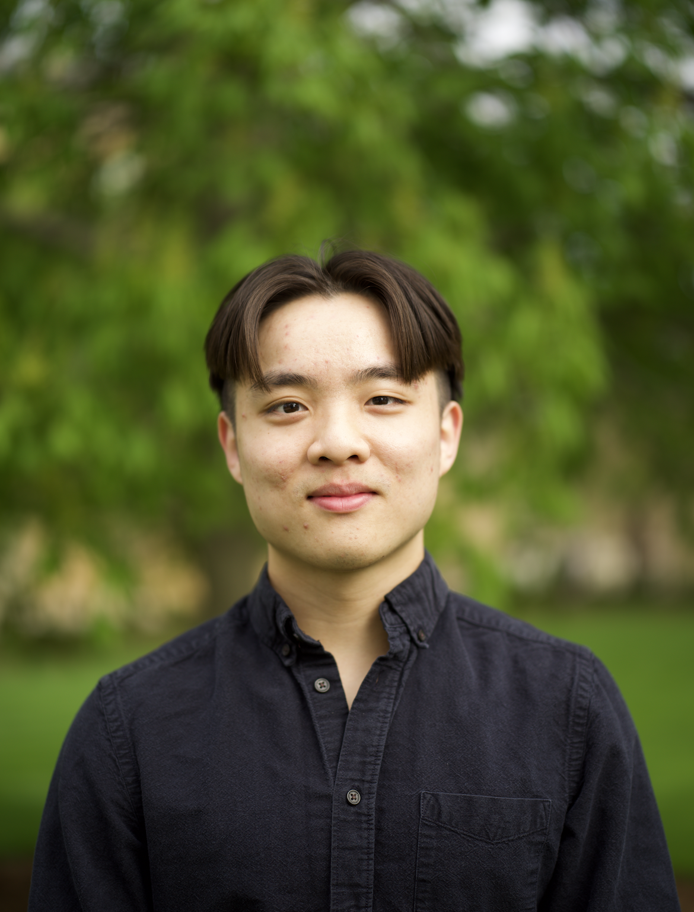

# Sui Jiet Tay

Please visit my [website](https://jiet.tech/) for my latest updates.

# About
I am a recent computer science graduate from the Department of Computer Sciences at the University of Wisconsin Madison. I am currently an undergraduate researcher at WISCERS. My interest revolves broadly in machine learning and data science. Topics I am currently exploring include:

- Transformers 
- Structure of Thoughts
- Weak supervision
- Deep learning
- Relational Databases

